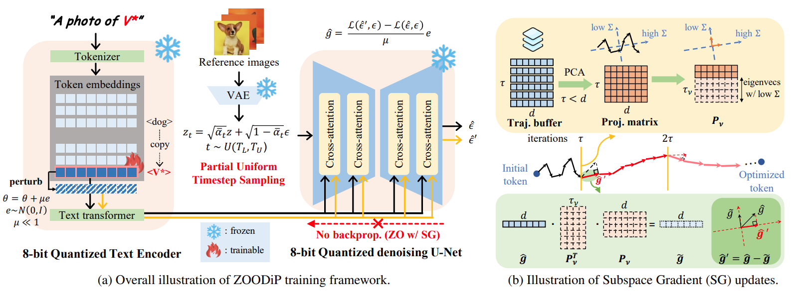

# 🌟 [CVPR 2025] Efficient Personalization of Quantized Diffusion Model without Backpropagation

## 📑 Introduction

> **Efficient Personalization of Quantized Diffusion Model without Backpropagation**
>
> [Hoigi Seo*](https://seohoiki3215.github.io), [Wongi Jeong*](https://ignoww.github.io/), [Kyungryeol Lee](https://krlee1.github.io/), [Se Young Chun](https://icl.snu.ac.kr/) (*co-first)
>
> 📚[arXiv](https://arxiv.org/abs/2503.14868)

This paper presents a novel approach to enabling personalization with a quantized text-to-image diffusion model while operating under minimal memory constraints and without reliance on backpropagation. Leveraging **zeroth-order (ZO) optimization**, the proposed method achieves personalization using merely **2.37GB** of VRAM on Stable Diffusion v1.5.


## 🚀 Usage

1. **Environment Setup**

   **Create and activate the Conda virtual environment:**

   ```bash
   conda env create -f environment.yaml
   conda activate zoodip
   ```
   Alternatively, install dependencies via `pip`:
    ```bash
    pip install -r requirements.txt
    ```

   Additionally, download dreambooth dataset from [here](https://github.com/google/dreambooth) and put them in `./dataset`:


2. **Folder Tree**
```md
ZOODiP
  ├── dataset
  │     ├── dreambooth dataset
  │     └── or custom dataset
  ├── results
  │     └── learned_embeds.safetensors
  ├── requirements.txt
  ├── environment.yaml
  ├── cc.json
  ├── train_zoodip.sh
  ├── train_zoodip.py
  └── inference.ipynb
```

3. **Configure Parameters**

   The implementation is primarily based on the **textual inversion** code from Diffusers, with the following additional parameters:
   - `n`: Number of gradient estimation for ZO optimization.
   - `tau`: Buffer size (see Algorithm. 1).
   - `nu`: Threshold that controls the amount of variance retained (see Algorithm. 1).
   - `use_cc`: Whether to use [comprehensive captioning](https://arxiv.org/pdf/2402.12004).

4. **Run the Example**

   Execute the main script `train_zoodip.sh`:

   ```bash
   sh train_zoodip.sh
   ```

   The learned embeddings will be saved in the `./results/` directory.

## 📸 Example Outputs

If the setup has been correctly configured and the training has been successfully completed, one can obtain images akin to those presented in `./inference.ipynb`.


## 🙏 Acknowledgments

This code is based on the textual inversion implementation provided by Diffusers. The referenced works are as follows:

- [🤗 Diffusers](https://github.com/huggingface/diffusers)
- [Textual Inversion](https://arxiv.org/abs/2208.01618)
